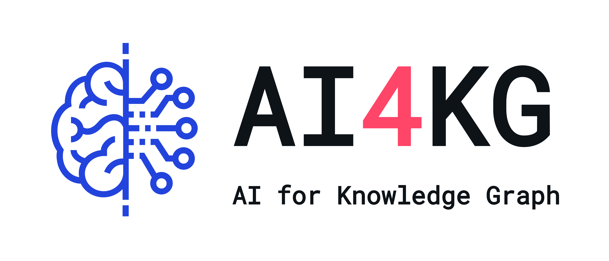

# AI4KG
Build &amp; Edit Knowledge Graph by AI

[](https://JasonDZS.github.io/AI4KG/)
[](https://github.com/JasonDZS/AI4KG/actions/workflows/deploy-docs.yml)



## 📖 Documentation

Visit our comprehensive documentation at: **[https://JasonDZS.github.io/AI4KG/](https://JasonDZS.github.io/AI4KG/)**

The documentation includes:
- API Reference
- Getting Started Guide
- Authentication
- Graph Management
- Node & Edge Operations
- File Processing
- Search Functionality

## 🚀 Quick Start

### Backend Setup
```bash
cd ai4kg/backend
pip install -r requirements.txt
uvicorn main:app --reload
```

### Frontend Setup
```bash
cd ai4kg/frontend
npm install
npm run dev
```

## 📚 Documentation Development

The documentation is automatically deployed to GitHub Pages when changes are pushed to the `docs/` directory.

### Local Preview
```bash
cd docs
python -m http.server 3000
# Or use docsify
npm i docsify-cli -g
docsify serve .
```

## 🤝 Community
[Discord](https://discord.gg/TAxPTxXF) use for communicate
